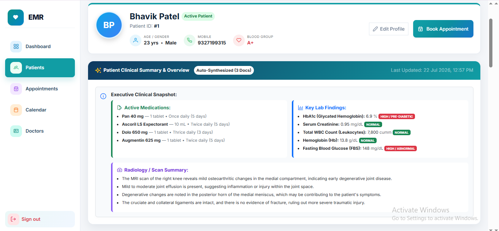
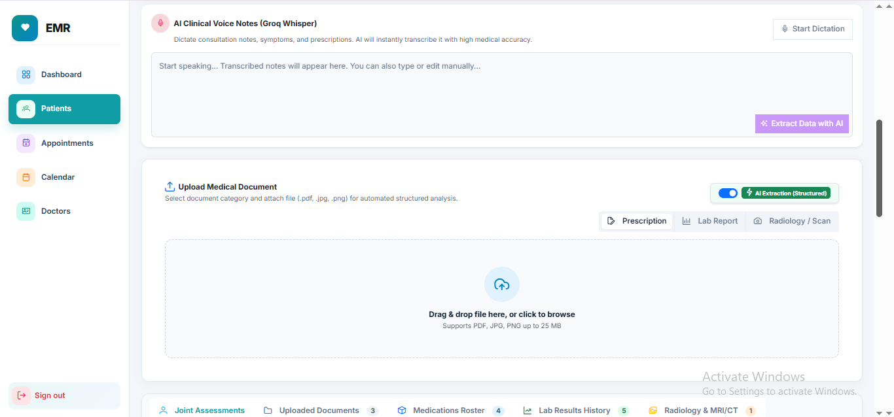

# 🏥 Enterprise Hospital Electronic Medical Records (EMR) System


An advanced, highly responsive, and AI-augmented **Hospital Electronic Medical Records (EMR) System** engineered from scratch using **Clean Architecture** on the backend (.NET 8 Web API + Entity Framework Core) and reactive **Angular Signals** + **PrimeNG** on the frontend.

**Enterprise-grade Hospital EMR system built with .NET 8 Web API (Clean Architecture) and Angular 18 (Reactive Signals). Features JWT RBAC, OPD scheduling, and a Hybrid AI Engine using Local OCR + Groq AI (Llama-3.3 Text / Vision) for document extraction, alongside real-time Voice Dictation (Groq Whisper AI) to auto-fill prescriptions, clinical summaries, and lab reports.**

---

## ✨ Key Highlights & Enterprise Features

### 🔐 1. Authentication & Role-Based Security
* **JWT Bearer Token Security:** Stateless, secure token-based authentication with salted password hashing.
* **Angular Route Guards (`AuthGuard`):** Strict frontend route protection ensuring unauthorized users are automatically redirected to the login portal.
* **Global HTTP Error & Auth Interceptor (`error.interceptor.ts`):** Automatically catches expired sessions (`401 Unauthorized`), server errors (`500`), and network disconnects, alerting users via sleek PrimeNG Toast notifications (`p-toast`).

### 🧑‍⚕️ 2. Comprehensive Patient Profile & AI Summarization
* **Patient Lifecycle Tracking:** Manage patient demographics, Unique Hospital ID (`UHID`), Age, Gender, Blood Group, Mobile contact, and Active status.
* **Executive Clinical Snapshot:** Auto-synthesized view of Active Medications, Key Lab Findings, and Radiology Summaries directly on the patient profile.
* **AI Clinical Voice Notes (Groq Whisper):** Integrated voice dictation for instant, high-accuracy medical transcription directly into the patient record.
* **Smart Medical Document Upload:** Drag-and-drop document processing with toggleable structured AI Extraction for Prescriptions, Lab Reports, and Scans.




### 👨‍⚕️ 3. Doctor Roster & OPD Scheduling
* **Doctor Directory:** Manage specialized doctors, qualifications, experience years, and consultation fee structures.
* **Interactive OPD Appointments:** Doctor-Patient linked appointment booking with real-time status management (`Pending`, `Confirmed`, `Completed`, `Cancelled`).
* **Live Clinical Dashboard:** Interactive summary cards and daily OPD queue overview.

### 📊 4. Advanced Clinical Dashboard (New)
* **Real-time Analytics:** Visual representation of hospital metrics using PrimeNG Charts (`Chart.js`).
* **Appointments Trend:** A Line Chart showing the 30-day trend of OPD appointments.
* **Patient Demographics:** A dynamic Donut Chart illustrating the gender distribution of registered patients.


### 🦴 5. Interactive Joint Assessment (Rheumatology Module) (New)
* **Visual Body Map:** A responsive, interactive SVG Anterior Skeleton allowing doctors to click directly on joints (Shoulders, Elbows, Wrists, Fingers, Hips, Knees, Toes) to record conditions.
* **Color-coded Joint States:** Visually distinguish between Normal (Green), Tender (Red), Swollen (Blue), Tender & Swollen (Purple), and Limited Movement (Orange).
* **Smart Visit History Calendar:** A dedicated Datepicker that highlights past patient visits with a green indicator. Selecting a past date locks the form into a secure Read-Only mode to protect historical clinical data.
* **Quick Actions & JSON Storage:** Features like "Mark All Normal" for rapid assessment. The entire complex joint state is serialized securely into a single JSON object in the backend.


---

## 📱 Core Modules Overview

Here is a visual overview of the 5 core modules available in our EMR system:

### 1. Dashboard


### 2. Patients


### 3. Appointments


### 4. Calendar


### 5. Doctors


---

## 🤖 6. Smart Hybrid AI Engine (Documents & Voice Dictation)

The core innovation of this EMR is its dual-flow intelligent data extraction system, capable of processing both physical medical records and live doctor dictations:

```
[ Upload Document (.PDF / .JPG) ]      [ Microphone Voice Dictation ]
               │                                      │
               ▼                                      ▼
   [ Local Tesseract OCR Engine ]          [ Groq Whisper AI ]
               │                                      │
     ┌─────────┴─────────┐                            │
     ▼                   ▼                            │
[ Groq Text-AI ]  [ Groq Vision AI ]                  │
     │                   │                            │
     └─────────┬─────────┘                            │
               ▼                                      ▼
        [ Structured JSON Auto-Fill in Clinical UI ]
        (Medications, Lab Findings, Clinical Notes)
```

### 🎙️ Flow A: Live Voice Dictation (`Groq Whisper`)
* **Real-time Transcription:** Doctors can speak symptoms and prescriptions directly into the UI. The `.webm` audio is captured via browser `MediaRecorder` API and streamed to the backend.
* **Whisper Integration:** The backend sends the audio to Groq Whisper for lightning-fast speech-to-text.
* **Auto-Data Extraction:** The transcribed text is automatically pipelined into Llama-3.3 to extract and auto-fill clinical summaries and structured medication regimens.

### 🔥 Flow B: Local OCR + Regular Expression Fallback
* Utilizes **`UglyToad.PdfPig`** for digital PDF parsing and local **`Tesseract OCR (eng)`** for text recognition.
* Runs custom clinical regex parsers to identify common medical keywords and dosages at zero API cost.

### ⚡ Flow C: AI-Powered Structured Extraction (`Groq / Llama-3`)
* **Text AI Engine (`llama-3.3-70b-versatile` / `grok-beta`):** Prompts the LLM with strict `response_format: { type: "json_object" }` instructions to parse printed lab reports, complete blood counts (`CBC`), and discharge summaries into structured arrays (`Medications`, `LabFindings`, `RadiologyNotes`).
* **Multimodal Vision AI Fallback (`llama-3.2-90b-vision-preview`):** Automatically triggers when an uploaded image yields low/empty OCR text, routing the Base64 image payload directly to Groq's Vision model. It reads messy cursive handwritten prescriptions (`Rx Amox 625mg TDS x 5 days`) with crystal clarity!

### 🎨 Sleek UI Integration
* **Single-Row Header Alignment:** Upload Dropzone title aligned horizontally with the `⚡ AI Extraction (Structured)` toggle switch.
* **Document Category Badges:** Quick pre-upload classification (`Prescription pi-file-edit` | `Lab Report` | `Radiology / Scan`).

---

## 🛡️ Enterprise Project Stabilization Shield

To ensure zero downtime and unhandled application crashes, the project incorporates a hardened stability shield:
1. **Global Exception Handling Middleware (`GlobalExceptionHandlingMiddleware.cs`):** Intercepts all unhandled C# server errors, logging details and returning standardized JSON responses (`{ success: false, statusCode: 500, message: "..." }`).
2. **Standardized Angular Error Interceptor:** Provides real-time user-friendly feedback for network connectivity loss (`Status 0`), unauthorized attempts (`401/403`), and bad request validation failures (`400`).

---

## 🏗️ Clean Architecture Breakdown

The `.NET 8` backend strictly adheres to **Clean Architecture / Onion Architecture** principles, enforcing separation of concerns across 5 distinct layers:

```
┌────────────────────────────────────────────────────────┐
│                   Angular 18 Frontend                  │
│       (Signals, PrimeNG, Reactive Forms, Guards)       │
└───────────────────────────┬────────────────────────────┘
                            │ REST API / JWT
┌───────────────────────────▼────────────────────────────┐
│                       EMR.API                          │
│     (Controllers, Global Middleware, Static Files)     │
└───────────────────────────┬────────────────────────────┘
                            │
┌───────────────────────────▼────────────────────────────┐
│                   EMR.Application                      │
│   (Services, DTOs, AutoMapper, Validation, Interfaces) │
└──────────────┬───────────────────────────┬─────────────┘
               │                           │
┌──────────────▼─────────────┐   ┌─────────▼─────────────┐
│         EMR.Domain         │   │  EMR.Infrastructure   │
│ (Entities, Enums, Core FKs)│   │ (EF Core, Repos, Groq)│
└────────────────────────────┘   └───────────────────────┘
```

* **`EMR.Domain`**: Core enterprise entities (`Patient`, `Doctor`, `Appointment`, `PatientDocument`, `User`, `Role`) and Enums (`AppointmentStatus`). Zero external dependencies.
* **`EMR.Application`**: Business logic, Data Transfer Objects (`PatientCreateDto`, `AiExtractedDocumentDto`, `MedicationItemDto`), AutoMapper profiles, and Service interfaces (`IAiDocumentExtractionService`).
* **`EMR.Infrastructure`**: EF Core `AppDbContext`, SQL Server/PostgreSQL database migrations, Repository implementations, and third-party integrations (`GroqAiDocumentExtractionService`).
* **`EMR.API`**: REST controllers (`PatientsController`, `AiDocumentExtractionController`, `AppointmentsController`), Swagger/OpenAPI configuration with JWT Bearer support, and CORS setup.
* **`EMR.Shared`**: Common utilities and password hashing helpers.

---

## 🛠️ Technology Stack

| Layer | Technologies & Tools |
| :--- | :--- |
| **Frontend Framework** | Angular 18+ (Standalone Components, Signals (`signal()`), Reactive Forms) |
| **UI Library & Styling** | PrimeNG (`p-toast`, `p-dropdown`), Angular Material (`MatPaginator`, `MatDialog`), SCSS |
| **Backend Framework** | .NET 8 Web API (C# 12) |
| **ORM & Database** | Entity Framework Core 8, SQL Server / PostgreSQL |
| **AI & LLM Engine** | Groq API (`llama-3.3-70b-versatile` Text Model, `llama-3.2-90b-vision-preview` Vision Model) |
| **OCR & PDF Engines** | Local Tesseract OCR (`TesseractEngine`), UglyToad.PdfPig |
| **Authentication** | JSON Web Tokens (`System.IdentityModel.Tokens.Jwt`), Custom PBKDF2 / SHA Hashing |

---

## 🚀 Getting Started & Local Setup

### 📋 Prerequisites
* [.NET 8.0 SDK](https://dotnet.microsoft.com/download/dotnet/8.0)
* [Node.js (v18+ or v20+)](https://nodejs.org/) & [Angular CLI](https://angular.dev/tools/cli) (`npm install -g @angular/cli`)
* SQL Server or PostgreSQL instance running locally.

### ⚙️ 1. Backend Setup (`EMR.Backend`)
1. Navigate to the backend root directory:
   ```bash
   cd EMR.Backend
   ```
2. Restore project dependencies and build all architectural layers:
   ```bash
   dotnet restore
   dotnet build
   ```
3. Configure your Database Connection and Groq API Key inside `EMR.API/appsettings.json`:
   ```json
   {
     "ConnectionStrings": {
       "DefaultConnection": "Server=localhost;Database=HospitalEMR_DB;Trusted_Connection=True;TrustServerCertificate=True;"
     },
     "Groq": {
       "ApiKey": "gsk_YOUR_GROQ_API_KEY_HERE",
       "Model": "llama-3.3-70b-versatile"
     }
   }
   ```
4. Apply Entity Framework Core migrations and start the server:
   ```bash
   dotnet run --project EMR.API/EMR.API.csproj
   ```
   *The API will start at `http://localhost:5000` / `https://localhost:5001`. Swagger UI is accessible at `/swagger`.*

### 💻 2. Frontend Setup (`emr-frontend`)
1. Open a new terminal window and navigate to the Angular workspace:
   ```bash
   cd emr-frontend
   ```
2. Install Node packages and dependencies:
   ```bash
   npm install
   ```
3. Launch the local development server:
   ```bash
   ng serve
   ```
4. Open your browser and navigate to `http://localhost:4200`.

---

## 🧪 Testing the AI Document Extraction Flow
1. Log into the EMR portal and open any **Patient Detail** page (`/patients/view/{id}`).
2. Ensure the `⚡ AI Extraction (Structured)` toggle switch is set to **ON**.
3. **Test Digital Reports:** Upload any computer-typed PDF (e.g., Blood Sugar / CBC test). The system extracts all table parameters and auto-fills the `Clinical Summary`, `Medications`, and `Lab Findings` instantly.
4. **Test Handwritten Prescriptions:** Upload a messy doctor's prescription (`.jpg/.png`). The Smart Multimodal Vision AI detects low OCR output and directly deciphers cursive handwriting to auto-populate the medication roster!

---

## 📄 License & Contributing
This project is developed as an Enterprise-grade EMR demonstration and production architecture template. Contributions, bug reports, and pull requests are welcome!

Made with ❤️ using **Clean Architecture**, **Angular Signals**, and **Multimodal Vision AI**.
